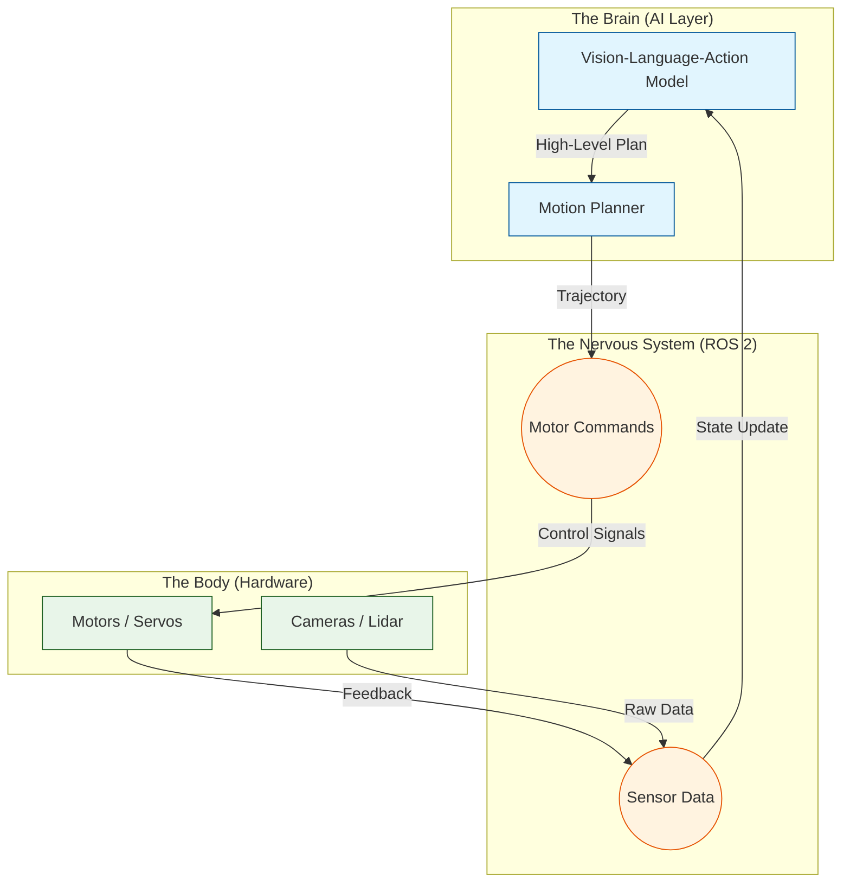

# Course Introduction

## Concept Overview

Welcome to the frontier of **Physical AI**.

Unlike **Generative AI** (ChatGPT, DALL-E), which operates in the digital realm to synthesize text or images, **Physical AI** is about **Embodied Intelligence**. It is the discipline of creating systems that can perceive, understand, and interact with the physical world through sensors and actuators.

> **Physical AI**: The synthesis of Large World Models (LWMs) with robotic hardware, creating a closed loop of Perception $\rightarrow$ Decision $\rightarrow$ Action.

In this course, we move beyond simple chatbots. We give the AI a body.

### The Brain-Body-Nervous System Analogy

To understand how modern humanoid robots function, we use a biological analogy that serves as the backbone of this textbook:

1.  **The Brain (AI Layer)**: High-level reasoning, planning, and vision. This is where Foundation Models (VLA) live.
2.  **The Nervous System (Middleware)**: The high-speed communication network that transmits signals between the brain and the body. In our case, this is **ROS 2**.
3.  **The Body (Hardware)**: The physical motors, joints, and sensors that interact with reality.

### System Architecture

The following diagram illustrates the flow of information in a Physical AI system:

## Prerequisites

This course is technically demanding. It bridges the gap between software engineering and hardware control. Please ensure you meet the following requirements before proceeding.

:::warning Hardware Requirement
**NVIDIA GPU Required**: To run the "Digital Twin" simulations (Isaac Sim / Gazebo) and train AI models effectively, you need a discrete NVIDIA GPU.
*   **Minimum**: RTX 3060 (6GB VRAM)
*   **Recommended**: RTX 4070 or better (12GB+ VRAM)
*   **Alternative**: If you lack a GPU, you can follow the "Code-Only" path, but you will not be able to render high-fidelity simulations.
:::

### Software Environment

We strictly support the **Long Term Support (LTS)** ecosystem for stability.

*   **Operating System**: 
    *   **Primary**: Ubuntu 22.04 LTS (Jammy Jellyfish)
    *   *Experimental*: Ubuntu 24.04 LTS (Noble Numbat)
*   **Middleware**: 
    *   **Primary**: ROS 2 Humble Hawksbill (for Ubuntu 22.04)
    *   *Experimental*: ROS 2 Jazzy Jalisco (for Ubuntu 24.04)
*   **Languages**:
    *   **Python**: 3.10+ (Standard)
    *   **C++**: 17 (Basic understanding required for performance nodes)

:::info Apple Silicon (M1/M2/M3) Users
ROS 2 support on macOS is experimental. We strongly recommend using a **Virtual Machine (VM)** running Ubuntu 22.04 or a dedicated Linux desktop/laptop for this course.
:::

## Course Structure

The textbook is divided into four progressive modules, mirroring the architecture of a Physical AI system.

### [Module 1: The Nervous System (ROS 2)](./module-01-nervous-system/overview)
**Focus**: Middleware & Communication.
We begin by building the infrastructure. You will learn how to create independent software "Nodes" that communicate over a distributed network, forming the nervous system of your robot.

### [Module 2: The Digital Twin](./module-02-digital-twin/course-introduction)
**Focus**: Simulation & Physics.
Before risking expensive hardware, we build a perfect replica of our robot in a virtual world. You will learn to use Gazebo and Unity to simulate physics, sensors, and environments.

### [Module 3: The AI Brain](./module-03-ai-brain/course-introduction)
**Focus**: Perception & Planning.
We inject intelligence into the system. Using NVIDIA Isaac Sim and Isaac ROS, you will implement computer vision, navigation (Nav2), and SLAM (Simultaneous Localization and Mapping).

### [Module 4: Vision-Language-Action (VLA)](./module-04-vla/course-introduction)
**Focus**: Embodied Intelligence.
The capstone module. We integrate Vision-Language Models (like GPT-4o or specialized VLAs) to allow the robot to understand natural language commands ("Pick up the red apple") and translate them into physical actions.

## Philosophy

We believe in **Spec-Driven Development**. You won't just copy code; you will design systems. Every module starts with a "Theory" phase, moves to "Architecture", and ends with "Implementation". This ensures you understand the *why* behind every line of code.

*Ready to give your AI a body? Start with Module 1.*