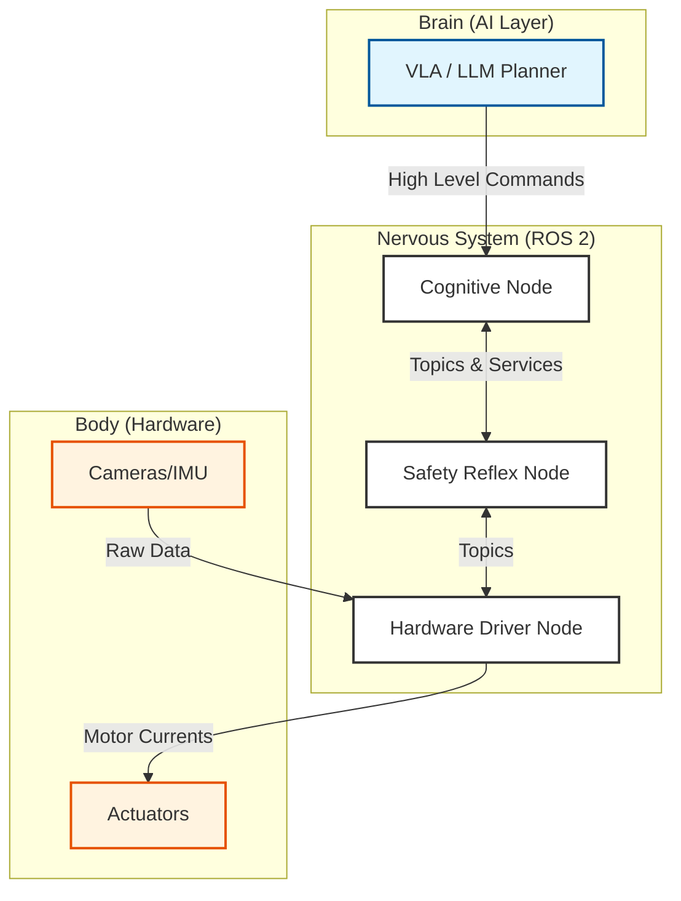

# Overview: The Robotic Nervous System

:::info
**Module Learning Objectives**
1.  **Define** the "Nervous System" analogy for ROS 2 in the context of Physical AI.
2.  **Explain** the necessity of middleware for modular robotic software.
3.  **Visualize** the ROS 2 Graph architecture and data flow.
4.  **Differentiate** between the control plane (ROS 2) and the data plane (DDS).
5.  **Critique** the advantages of a distributed system over a monolithic one.
:::

## Prerequisites

Before starting this module, ensure you have:
*   Basic familiarity with **Python 3.10+**.
*   A working installation of **ROS 2 (Humble or Jazzy)** on Ubuntu 22.04/24.04 or via Docker.
*   Understanding of basic Linux CLI commands.

### Concept Overview

In the anatomy of a Physical AI, if the Large Language Model (LLM) is the "Brain" and the motors/sensors are the "Body," then **ROS 2 (Robot Operating System 2)** is the **"Nervous System."**

It is the middleware responsible for transmitting high-speed signals (sensor data, motor commands) between independent organs (software components) of the robot. Without it, the brain is disconnected from the body.

### System-Level Intuition

A complex robot is not a single program. It is a collection of dozens, sometimes hundreds, of independent programs running simultaneously.

**Biological Analogy**:
*   **Reflexes**: Your hand pulls away from a hot stove before your brain consciously registers pain. Similarly, a robot's safety stop runs on a low-level "reflex" node, independent of the high-level AI planner.
*   **Modularity**: Your eyes process vision independently of your ears processing sound. In ROS 2, the camera driver and the microphone driver are separate "Nodes" that don't know each other exist.

**Engineering Architecture**:
ROS 2 employs a **Publish-Subscribe** pattern.
*   **Publishers**: Broadcasters (e.g., a Camera Node shouting "Here is an image!").
*   **Subscribers**: Listeners (e.g., an Object Detector Node listening for "images").
*   **The Network**: The "bus" where these messages travel.

### Theory & Fundamentals

The core theoretical model of ROS 2 is the **Computation Graph**.

#### Key Concepts

1.  **Nodes**: The fundamental unit of computation. A single executable (e.g., `camera_driver`).
2.  **Messages**: The data structure defining the information payload (e.g., `sensor_msgs/Image`).
3.  **Discovery**: How nodes find each other. ROS 2 uses **DDS (Data Distribution Service)** for decentralized discovery. No central server is needed.

#### The Distributed Systems Theorem (CAP Theorem applicability)
While ROS 2 is not a database, it faces distributed system challenges. It prioritizes **Availability** and **Partition Tolerance** in its design, often relying on "Best Effort" communication (UDP) for sensor data to maintain real-time performance.

### Architecture & Components

The ROS 2 architecture is layered:

1.  **User Code**: Your Python (`rclpy`) or C++ (`rclcpp`) code.
2.  **Client Library (rcl)**: The C API that provides standard ROS behavior.
3.  **Middleware Interface (rmw)**: An abstraction layer adapting to different DDS vendors.
4.  **DDS Implementation**: The industry-standard connectivity framework (e.g., CycloneDDS, FastDDS).
5.  **OS**: Linux, Windows, macOS, RTOS.

### Diagrams

The following diagram illustrates the "Nervous System" connecting the Brain (AI) to the Body (Hardware).



### Algorithms & Models

ROS 2 execution is governed by the **Executor**.

**The Execution Loop**:
1.  **Wait**: The Executor sleeps until a message arrives or a timer expires.
2.  **Wake**: An event (e.g., new image) triggers a callback.
3.  **Execute**: The specific callback function runs (e.g., `process_image()`).
4.  **Return**: The callback finishes, and the Executor goes back to sleep.

This event-driven architecture is efficient but requires care to avoid blocking the main thread.

### Code Examples

A minimal "Nervous System" node in Python that keeps the system "alive" (Heartbeat).

```python title="heartbeat_node.py"
import rclpy
from rclpy.node import Node
from std_msgs.msg import String

class HeartbeatNode(Node):
    """
    A simple node that pulses a 'heartbeat' signal to the rest of the system.
    """
    def __init__(self):
        super().__init__('heartbeat_node')
        # Create a Publisher: talking to the 'nervous_system_status' topic
        self.publisher_ = self.create_publisher(String, 'system_status', 10)
        
        # Create a Timer: reflex loop running at 1Hz (every 1.0 seconds)
        self.timer = self.create_timer(1.0, self.timer_callback)
        self.get_logger().info('Nervous System Heartbeat Started')

    def timer_callback(self):
        msg = String()
        msg.data = 'ALIVE'
        self.publisher_.publish(msg)
        self.get_logger().info(f'Pulse: {msg.data}')

def main(args=None):
    rclpy.init(args=args)
    node = HeartbeatNode()
    
    try:
        # Keep the node alive, listening for events
        rclpy.spin(node)
    except KeyboardInterrupt:
        pass
    finally:
        node.destroy_node()
        rclpy.shutdown()

if __name__ == '__main__':
    main()
```

### Practical Applications

1.  **NASA Viper Rover**: Uses ROS 2 to manage the complexity of lunar exploration, allowing different teams to build the navigation, vision, and drilling systems independently.
2.  **Universal Robots**: Industrial arms use ROS 2 interfaces to allow researchers to bypass the proprietary controller and send direct motor commands.
3.  **Self-Driving Cars (Autoware)**: A massive graph of over 100 nodes handling everything from Lidar point cloud processing to traffic light detection.

### Common Pitfalls & Design Trade-offs

*   **Trade-off: Latency vs. Reliability**:
    *   *TCP (Reliable)*: Good for parameters and setup. Bad for real-time control (retries cause lag).
    *   *UDP (Best Effort)*: Good for sensor data. If a packet is lost, ignore it; the next one is coming in 10ms.
*   **Pitfall: Monolithic Nodes**:
    *   Putting all your code in one giant node defeats the purpose of ROS.
    *   *Solution*: Break functionality into small, focused nodes (Single Responsibility Principle).

### Mini Project / Lab

**Task**: Verify your Nervous System.

**Steps**:
1.  Open a terminal and run `ros2 run demo_nodes_cpp talker`.
2.  Open a second terminal and run `ros2 run demo_nodes_py listener`.
3.  Observe the communication.

**Expected Output**:
*   Terminal 1: `[INFO]: Publishing: 'Hello World: 1'`
*   Terminal 2: `[INFO]: I heard: [Hello World: 1]`

**Tools Required**:
*   ROS 2 Installation

### Review & Checkpoints

*   **Analogy**: ROS 2 is the Nervous System.
*   **Unit**: The Node is the basic unit of computation.
*   **Transport**: Messages travel via Topics (Publisher/Subscriber).
*   **Discovery**: Decentralized via DDS.

### Further Reading

*   **Papers**: *Maruyama, Y., et al. (2016). "Exploring the performance of ROS2."* (Early performance analysis).
*   **Documentation**: [ROS 2 Documentation](https://docs.ros.org/)
*   **Books**: *C. Newman. (2023). "A Systematic Approach to Learning Robot Programming with ROS."*
