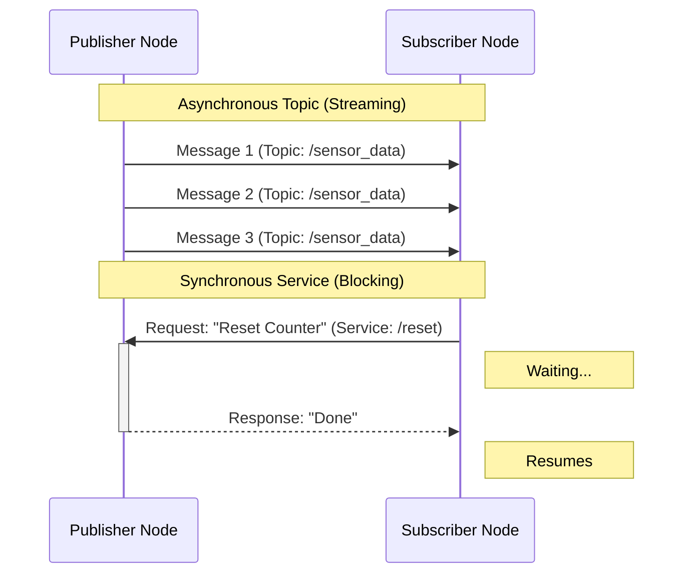

# Nodes, Topics, and Services

:::info
**Module Learning Objectives**
1.  **Differentiate** between the asynchronous nature of Topics and the synchronous nature of Services.
2.  **Implement** a basic Publisher and Subscriber using `rclpy`.
3.  **Implement** a basic Service Client and Server using `rclpy`.
4.  **Analyze** the role of Quality of Service (QoS) in lossy networks.
5.  **Debug** communication issues using ROS 2 CLI tools.
:::

## Prerequisites

*   Completion of **01-Overview**.
*   Understanding of Python classes and inheritance.

### Concept Overview

If Nodes are the organs of the robot, **Topics** and **Services** are the veins and nerves connecting them.

*   **Topics (Veins)**: Continuous flow of blood (data). The heart pumps without asking the liver if it's ready. (Asynchronous, One-to-Many).
*   **Services (Nerves)**: Specific signals for specific actions. The brain tells the hand to "close" and waits for a confirmation. (Synchronous, One-to-One).

### System-Level Intuition

**The Town Hall Analogy (Topics)**:
A Topic is like a radio station.
*   **Publisher**: The DJ broadcasting music. They don't know who is listening.
*   **Subscriber**: The listeners tuning in. They don't know who is the DJ.
*   **Anonymous**: You can replace the DJ, and the listeners won't notice as long as the music (message type) is the same.

**The Pizza Delivery Analogy (Services)**:
A Service is like ordering a pizza.
*   **Client**: You call and place an order (Request). You stop cooking and wait.
*   **Server**: The pizza place receives the order, cooks it, and delivers it (Response).
*   **Blocking**: You can't eat until the pizza arrives.

### Theory & Fundamentals

#### 1. Topics (Publish-Subscribe)

*   **Protocol**: UDP (usually). Best-effort delivery.
*   **Coupling**: Loosely coupled.
*   **Use Case**: Sensor data (Lidar, Camera), Robot State (Position).

**Quality of Service (QoS)**:
*   **Reliability**: `Reliable` (TCP-like, retries) vs. `Best Effort` (UDP-like, drop packets).
*   **Durability**: `Volatile` (no history) vs. `Transient Local` (late-joiners get the last message).

#### 2. Services (Request-Response)

*   **Protocol**: TCP-like. Reliable delivery.
*   **Coupling**: Tighter coupling.
*   **Use Case**: Mode switching, calibration, computation requests (e.g., "Plan a path").

### Architecture & Components

The following diagram shows the interaction between two nodes using both a Topic and a Service.



### Algorithms & Models

**The Service Handshake**:
1.  **Advertising**: Server tells ROS Master (DDS) "I offer service X".
2.  **Lookup**: Client asks "Who offers service X?".
3.  **Connection**: Client and Server establish a direct link.
4.  **Transaction**: Client sends Request -> Server processes -> Server sends Response.

### Code Examples

#### 1. The Publisher (Topic)

```python title="simple_publisher.py"
import rclpy
from rclpy.node import Node
from std_msgs.msg import String

class SimplePublisher(Node):
    def __init__(self):
        super().__init__('simple_publisher')
        self.publisher_ = self.create_publisher(String, 'topic', 10)
        self.timer = self.create_timer(0.5, self.timer_callback)
        self.i = 0

    def timer_callback(self):
        msg = String()
        msg.data = f'Hello World: {self.i}'
        self.publisher_.publish(msg)
        self.get_logger().info(f'Publishing: "{msg.data}" ')
        self.i += 1

def main(args=None):
    rclpy.init(args=args)
    node = SimplePublisher()
    rclpy.spin(node)
    node.destroy_node()
    rclpy.shutdown()
```

#### 2. The Service Server

```python title="add_two_ints_server.py"
from example_interfaces.srv import AddTwoInts
import rclpy
from rclpy.node import Node

class MinimalService(Node):
    def __init__(self):
        super().__init__('minimal_service')
        self.srv = self.create_service(AddTwoInts, 'add_two_ints', self.add_two_ints_callback)

    def add_two_ints_callback(self, request, response):
        response.sum = request.a + request.b
        self.get_logger().info(f'Incoming request\na: {request.a} b: {request.b}')
        return response

def main(args=None):
    rclpy.init(args=args)
    node = MinimalService()
    rclpy.spin(node)
    rclpy.shutdown()
```

### Practical Applications

1.  **Lidar Stream**: A topic `/scan` publishing millions of points per second. Using `Best Effort` QoS ensures the robot always acts on the *latest* scan, not old data.
2.  **Gripper Control**: A service `/gripper/grasp` is used. The robot waits for the gripper to confirm "Object Grasped" before trying to lift it.
3.  **Battery Monitor**: A topic `/battery_state` publishes voltage at 1Hz.

### Common Pitfalls & Design Trade-offs

*   **Pitfall: Using Services for Data Streaming**:
    *   *Bad*: Calling a service `GetImage` 30 times a second. The overhead of the handshake will kill performance.
    *   *Good*: Use a Topic for images.
*   **Pitfall: Blocking the Main Thread**:
    *   *Bad*: `time.sleep(5)` inside a callback. The Node stops responding to *everything*.
    *   *Good*: Use a Timer or a State Machine.

### Mini Project / Lab

**Task**: Create a "Ping-Pong" system.

**Steps**:
1.  Create `PingNode` that publishes "Ping" to topic `/ping`.
2.  Create `PongNode` that subscribes to `/ping`.
3.  When `PongNode` receives "Ping", it calls a service `/score` on `PingNode` to increment a counter.

**Expected Output**:
*   PingNode: "Ping sent... Score updated to 1"
*   PongNode: "Received Ping, calling Service..."

### Review & Checkpoints

*   **Topics**: Use for continuous data flow (Sensor -> Controller).
*   **Services**: Use for transactions (Controller -> Actuator Command).
*   **QoS**: Check your reliability settings if nodes aren't talking.

### Further Reading

*   **Documentation**: [ROS 2 QoS Policies](https://docs.ros.org/en/humble/Concepts/About-Quality-of-Service-Settings.html)
*   **Papers**: *Maruyama, Y., et al. (2016). "Exploring the performance of ROS2."* (Reference for QoS/DDS performance).
