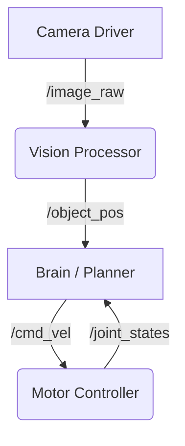

# System Intuition

## The Biological Analogy
Imagine a humanoid robot as a human body:
*   **The Brain (AI/Planner)**: Makes high-level decisions ("Pick up the apple").
*   **The Nervous System (ROS 2)**: Transmits that decision as a series of electrical signals to the muscles.
*   **The Muscles (Actuators)**: Execute the movement based on the signals.
*   **The Senses (Sensors)**: Provide feedback ("Apple felt", "Arm moving") back to the brain.

ROS 2 provides the **synapses** and **pathways** for this communication. It ensures that when the "Brain" says "Move", the "Arm" actually receives that command, even if they are running on different computers or processes.

## The Engineering Reality: The Graph
In engineering terms, a ROS 2 system is a **Computation Graph**.

*   **Nodes**: Individual processes performing specific tasks (e.g., `camera_driver`, `motion_planner`, `motor_controller`).
*   **Topics**: Named buses over which nodes exchange messages (e.g., `/camera/image_raw`, `/joint_states`).
*   **Services**: Request/Reply interactions (e.g., `/reset_simulation`).

For a humanoid, this graph is complex. You might have 50+ nodes running simultaneously—one for each limb controller, one for vision, one for balance, etc. ROS 2 manages the discovery and data transfer between them automatically.

## Why Middleware?
Why not just write a single giant Python script?
1.  **Concurrency**: Robots do many things at once. Reading 10 sensors while calculating inverse kinematics requires parallel execution.
2.  **Modularity**: You can swap out the `camera_driver` node for a different camera without rewriting the `vision_processing` node.
3.  **Distributed Computing**: The "Brain" might run on a heavy desktop GPU, while the "Reflexes" run on an embedded Jetson board inside the robot. ROS 2 handles the network communication seamlessly.