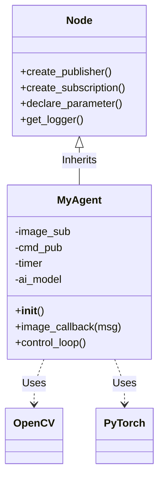

# Python Agents with rclpy

:::info
**Module Learning Objectives**
1.  **Construct** robust ROS 2 nodes using Object-Oriented Programming (OOP) principles.
2.  **Manage** node lifecycle and execution policies (Single vs. Multi-threaded Executors).
3.  **Integrate** third-party Python libraries (NumPy, OpenCV, PyTorch) into ROS 2 nodes.
4.  **Implement** ROS 2 Parameters for dynamic runtime configuration.
5.  **Develop** reusable and modular agent classes.
:::

## Prerequisites

*   Completion of **02-Nodes, Topics, & Services**.
*   Intermediate Python (Decorators, Threading, Inheritance).

### Concept Overview

`rclpy` is the bridge between the Python world and the ROS 2 core. It allows you to wrap standard Python logic—like an AI inference loop or a sensor driver—inside a ROS 2 Node shell.

### System-Level Intuition

**The Spacesuit Analogy**:
Your Python script (e.g., an Image Classifier) is an astronaut.
*   **Space**: The harsh, distributed environment of ROS 2.
*   **rclpy Node**: The spacesuit. It provides life support (power/threads), communication radio (topics), and protection (error handling).
*   **The Astronaut**: Just focuses on the mission (classifying images), not on how to breathe (transporting bytes over UDP).

### Theory & Fundamentals

#### 1. The Node Class

Inheriting from `rclpy.node.Node` gives your class superpowers:
*   **Logging**: `self.get_logger().info()` (Thread-safe logging).
*   **Time**: `self.get_clock().now()` (Simulated time aware).
*   **Parameters**: `self.declare_parameter()` (Dynamic configuration).

#### 2. Execution Model (Spinning)

ROS 2 uses a **Executor** pattern.
*   `rclpy.spin(node)`: Blocks the main thread and processes callbacks (Timer, Subscriber) as they arrive.
*   **SingleThreadedExecutor**: Default. Callbacks run sequentially. One stuck callback freezes the node.
*   **MultiThreadedExecutor**: Callbacks can run in parallel. Requires thread safety awareness.

### Architecture & Components

The following diagram shows the internal structure of a robust `rclpy` node.



### Algorithms & Models

**The Callback Queue**:
When a message arrives, it doesn't interrupt your code immediately. It sits in a queue (DDS queue -> Middleware queue -> Executor queue). The `spin` loop picks it up and executes the callback.

**Frequency Control**:
Using `create_timer(1.0 / hz, callback)` is the standard way to run control loops. Do not use `while True:` loops, as they block the Executor from processing other callbacks.

### Code Examples

#### A Parameterized Agent Node

This node demonstrates best practices: OOP, Parameters, and Timer-based execution.

```python title="parameterized_agent.py"
import rclpy
from rclpy.node import Node
from std_msgs.msg import String

class AgentNode(Node):
    def __init__(self):
        super().__init__('agent_node')
        
        # 1. Declare Parameters (Best Practice for configuration)
        self.declare_parameter('agent_name', 'Bond')
        self.declare_parameter('frequency', 1.0)
        
        # 2. Read Parameters
        self.name = self.get_parameter('agent_name').value
        self.freq = self.get_parameter('frequency').value
        
        # 3. Create Publishers/Subscribers
        self.pub_ = self.create_publisher(String, 'mission_status', 10)
        
        # 4. Create Main Loop Timer
        self.timer = self.create_timer(1.0 / self.freq, self.control_loop)
        
        self.get_logger().info(f'Agent {self.name} initialized at {self.freq}Hz')

    def control_loop(self):
        """
        The main brain of the agent. Runs periodically.
        """
        msg = String()
        msg.data = f'Agent {self.name} is scanning...'
        self.pub_.publish(msg)

def main(args=None):
    rclpy.init(args=args)
    node = AgentNode()
    
    try:
        rclpy.spin(node)
    except KeyboardInterrupt:
        pass
    finally:
        node.destroy_node()
        rclpy.shutdown()
```

### Practical Applications

1.  **AI Integration**: Load a PyTorch model in `__init__`. In the subscriber callback, convert the ROS image to a Tensor, run inference, and publish the result.
2.  **PID Controller**: A timer runs at 100Hz. In the callback, calculate Error = Target - Current, compute PID, and publish Torque.
3.  **Bridge Node**: Listen to MQTT messages from the cloud and republish them as ROS 2 topics for the robot.

### Common Pitfalls & Design Trade-offs

*   **Pitfall: Heavy Computation in Callbacks**:
    *   *Problem*: Running a 500ms neural network inference in a subscriber callback blocks the heartbeat and other sensors.
    *   *Solution*: Use a separate thread or a `MultiThreadedExecutor`.
*   **Pitfall: Global Variables**:
    *   *Problem*: Using global variables makes nodes hard to test and restart.
    *   *Solution*: Store state in `self.variable` inside the class.

### Mini Project / Lab

**Task**: Create a "Smart Thermostat" Agent.

**Steps**:
1.  Create a node `Thermostat`.
2.  Declare a parameter `target_temp` (default 22.0).
3.  Subscribe to `/temperature` (Float32).
4.  If current temp < target temp, publish "Heater ON" to `/heater`.

**Expected Output**:
*   Launch with `ros2 run pkg node --ros-args -p target_temp:=25.0`
*   Publish 20.0 to `/temperature`.
*   See "Heater ON" on `/heater`.

### Review & Checkpoints

*   **OOP**: Always inherit from `Node`.
*   **Parameters**: Don't hardcode values; use `declare_parameter`.
*   **Spin**: You must spin the node to process events.

### Further Reading

*   **Documentation**: [rclpy API Reference](https://docs.ros2.org/latest/api/rclpy/)
*   **Tutorials**: [Writing a simple publisher and subscriber (Python)](https://docs.ros.org/en/humble/Tutorials/Beginner-Client-Libraries/Writing-A-Simple-Py-Publisher-And-Subscriber.html)
