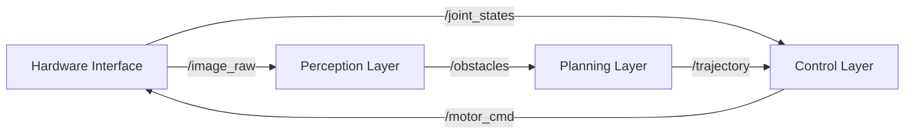

# Architecture & Components

## The Humanoid Pipeline
A typical humanoid software stack follows a **Sense-Plan-Act** pipeline, orchestrated by ROS 2.

1.  **Hardware Interface Layer**: Drivers for motors (Dynamixel, EtherCAT) and sensors (IMU, RealSense). These nodes publish raw data (`/joint_states`, `/image_raw`).
2.  **Perception Layer**: Nodes that process raw data into semantic information (e.g., `human_pose_estimator`, `obstacle_detector`).
3.  **Planning Layer**: The "Brain". Uses perception data to generate trajectories (e.g., MoveIt 2, Nav2).
4.  **Control Layer**: Converts trajectories into low-level motor commands (Torque/Position) ensuring stability (e.g., `ros2_control`).



## URDF: The Body Schema
The **Unified Robot Description Format (URDF)** is an XML file that describes the robot's physical structure to the software. It defines:
*   **Links**: Rigid bodies (bones).
*   **Joints**: Connections between links (shoulders, elbows).
*   **Visuals**: 3D meshes for display.
*   **Collisions**: Simplified geometry for physics engines.
*   **Inertial**: Mass and moments of inertia.

```xml title="simple_robot.urdf"
<robot name="simple_bot">
  <!-- Base Link -->
  <link name="base_link">
    <visual>
      <geometry>
        <box size="0.5 0.5 0.2"/>
      </geometry>
    </visual>
  </link>

  <!-- Arm Link -->
  <link name="arm_link">
    <visual>
      <geometry>
        <cylinder length="0.6" radius="0.05"/>
      </geometry>
    </visual>
  </link>

  <!-- Joint connecting them -->
  <joint name="shoulder_joint" type="revolute">
    <parent link="base_link"/>
    <child link="arm_link"/>
    <origin xyz="0 0 0.2"/>
    <axis xyz="0 1 0"/>
    <limit lower="-1.57" upper="1.57" effort="10.0" velocity="1.0"/>
  </joint>
</robot>
```

Without a correct URDF, the software assumes the robot is a point mass or has the wrong dimensions, leading to catastrophic control failures.

## DDS: The Hidden Layer
Underneath ROS 2 sits **DDS (Data Distribution Service)**. This is the industry-standard networking protocol used in battleships and financial trading. It handles the actual transport of UDP packets.
*   **QoS (Quality of Service)**: You can tune reliability.
    *   *Reliable*: Like TCP. Guarantees delivery (good for parameters).
    *   *Best Effort*: Like UDP. Fast, drop packets if network is busy (good for high-frequency sensor data).