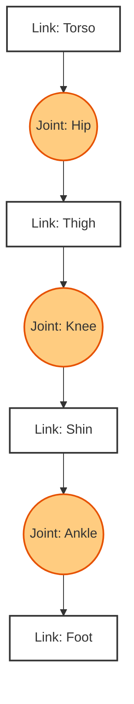

# URDF and Humanoid Modeling

:::info
**Module Learning Objectives**
1.  **Compose** a valid URDF (Unified Robot Description Format) file for a multi-jointed robot.
2.  **Differentiate** between Fixed, Revolute, Prismatic, and Continuous joints.
3.  **Construct** a kinematic tree representing a humanoid robot structure.
4.  **Visualize** TF2 frames and transformations in RViz.
5.  **Simulate** joint movements by publishing to `/joint_states`.
:::

## Prerequisites

*   Completion of **03-Python Agents**.
*   Basic understanding of 3D coordinates (X, Y, Z, Roll, Pitch, Yaw).

### Self-Image

A robot needs a self-image. It needs to know "Where is my hand relative to my eyes?" to grab a cup.
**URDF** is the file format defining this body structure. **TF2** is the library that calculates the math of moving parts in real-time.

### The Marionette

**The Marionette Analogy**:
*   **URDF**: The blueprint of the marionette. "The leg bone is connected to the hip bone."
*   **Joint States**: The strings. "Pull the knee string to 45 degrees."
*   **TF2**: The audience's view. If the torso moves forward, TF2 calculates where the hand ends up in the world.

### Kinematic Trees & Transforms

#### 1. The Kinematic Tree

Robots are trees of **Links** (bones) connected by **Joints** (motors).
*   **Root Link**: Usually `base_link` or `world`. Everything moves relative to this.
*   **Child Link**: Moves relative to its parent.

#### 2. Transforms (TF2)

A robot is a collection of coordinate frames.
*   `base_link` -> `torso` -> `arm` -> `hand`.
To get the hand position in the world, you multiply the transformation matrices of the chain. TF2 does this automatically.

### Skeletal Structure

The following diagram illustrates a simple humanoid leg structure (Hip -> Thigh -> Shin -> Foot).



### Forward vs. Inverse Kinematics

**Forward Kinematics**:
Given joint angles ($q$), calculate end-effector position ($x$).
$$ x = f(q) $$
This is what `robot_state_publisher` does using the URDF.

**Inverse Kinematics (IK)**:
Given desired position ($x$), calculate joint angles ($q$).
$$ q = f^{-1}(x) $$
This is hard (multiple solutions) and usually handled by libraries like `MoveIt`.

### Defining and Moving a Leg

#### 1. A Simple URDF (XML)

```xml title="simple_leg.urdf"
<?xml version="1.0"?>
<robot name="one_legged_robot">

  <!-- Base Link -->
  <link name="base_link">
    <visual>
      <geometry><box size="0.5 0.5 0.2"/></geometry>
    </visual>
  </link>

  <!-- Leg Link -->
  <link name="leg_1">
    <visual>
      <geometry><cylinder length="0.6" radius="0.05"/></geometry>
    </visual>
  </link>

  <!-- Hip Joint -->
  <joint name="hip_joint" type="revolute">
    <parent link="base_link"/>
    <child link="leg_1"/>
    <origin xyz="0 0.2 0" rpy="0 0 0"/>
    <axis xyz="1 0 0"/>
    <limit lower="-1.5" upper="1.5" effort="10" velocity="1"/>
  </joint>

</robot>
```

#### 2. Joint State Publisher (Python)

This script animates the robot by wiggling the hip joint.

```python title="wobbly_leg.py"
import rclpy
from rclpy.node import Node
from sensor_msgs.msg import JointState
import math

class WobblyLeg(Node):
    def __init__(self):
        super().__init__('wobbly_leg')
        self.pub_ = self.create_publisher(JointState, 'joint_states', 10)
        self.timer = self.create_timer(0.1, self.timer_callback)
        self.t = 0.0

    def timer_callback(self):
        msg = JointState()
        msg.header.stamp = self.get_clock().now().to_msg()
        msg.name = ['hip_joint']
        
        # Sine wave motion
        angle = math.sin(self.t)
        msg.position = [angle]
        
        self.pub_.publish(msg)
        self.t += 0.1

def main(args=None):
    rclpy.init(args=args)
    node = WobblyLeg()
    rclpy.spin(node)
    rclpy.shutdown()
```

### Why Visualization Matters

1.  **Visualization (RViz)**: You can't debug a robot you can't see. URDF allows you to see the robot's state in 3D.
2.  **Collision Checking**: The URDF defines collision geometry (simplified shapes) used by the motion planner to avoid hitting self or walls.
3.  **Sim-to-Real**: The same URDF is used in Gazebo (Simulation) and on the physical robot, ensuring the math matches reality.

### Visual vs. Collision

*   **Pitfall: Visual vs. Collision**:
    *   *Bad*: Using a 10MB high-poly mesh for collision. Physics engine will crash.
    *   *Good*: Use detailed meshes for `<visual>` and simple boxes/cylinders for `<collision>`.
*   **Pitfall: Tree vs. Graph**:
    *   URDF only supports Trees (no closed loops). If you have a 4-bar linkage (closed loop), you must simulate it or use SDF (Simulation Description Format).

### Lab: Visualize in RViz

**Task**: Visualize your Leg.

**Steps**:
1.  Save the XML above as `leg.urdf`.
2.  Install `urdf_tutorial`: `sudo apt install ros-humble-urdf-tutorial`.
3.  Launch display: `ros2 launch urdf_tutorial display.launch.py model:=leg.urdf`.
4.  Move the slider in the GUI to move the joint.

**Expected Output**:
*   An RViz window opens showing a box and a cylinder.
*   A "Joint State Publisher" GUI allows you to wiggle the leg.

### Summary

*   **Links**: Mass and Geometry.
*   **Joints**: Kinematics and Limits.
*   **TF2**: The math library handling the transforms.

### Further Reading

*   **Documentation**: [URDF XML Specification](http://wiki.ros.org/urdf/XML)
*   **Tutorials**: [Building a Visual Robot Model](https://docs.ros.org/en/humble/Tutorials/Intermediate/URDF/Building-a-Visual-Robot-Model-with-URDF-from-Scratch.html)
