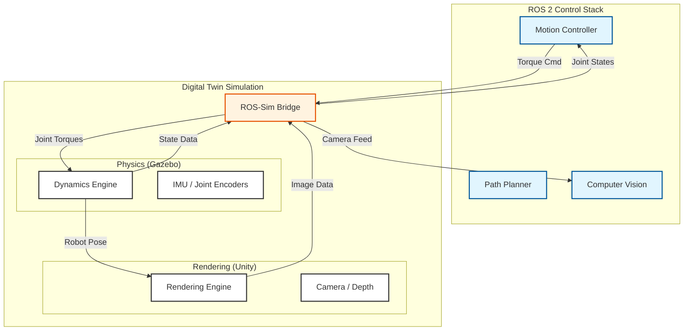

# Course Introduction: The Digital Twin

:::info
**Module Learning Objectives**
1.  **Define** the role of a Digital Twin in the context of Physical AI and Humanoid Robotics.
2.  **Explain** the trade-offs between physics fidelity (Gazebo) and visual fidelity (Unity).
3.  **Architect** a simulation pipeline that integrates physics, rendering, and sensor data.
4.  **Implement** basic environment setups in Gazebo and Unity linked to ROS 2.
5.  **Evaluate** sensor simulation strategies for LiDAR, Cameras, and IMUs.
:::

## Prerequisites

Before starting this module, ensure you have:
*   Completed **Module 1: The Nervous System (ROS 2)**.
*   Basic familiarity with **Python** and **C#** (for Unity scripting).
*   Installed **ROS 2 (Humble or Jazzy)**, **Gazebo (Harmonic)**, and **Unity Hub**.

### The "Dream State" of Robots

A **Digital Twin** in Physical AI is not merely a 3D model; it is a dynamic, physics-compliant replica of a physical robot and its environment. It serves as the training ground where the "Brain" (AI models) learns to control the "Body" (Hardware) without the risks and costs associated with physical testing.

In humanoid robotics, the Digital Twin is essential for:
*   **Safety**: Testing walking algorithms without breaking expensive hardware.
*   **Scalability**: Running thousands of simulation instances in parallel for Reinforcement Learning.
*   **Ground Truth**: Accessing perfect data (e.g., exact robot pose, segmentation masks) that is noisy or unavailable in the real world.

### Simulation vs. Reality

Think of the Digital Twin as the **"Dream State"** of the robot. Just as humans simulate future scenarios in their minds to predict outcomes, a robot uses its Digital Twin to predict the consequences of its actions before executing them.

**Biological Analogy**:
*   **Mental Imagery**: When you imagine catching a ball, your brain simulates the physics of the ball's trajectory and your arm's movement.
*   **Digital Twin**: The robot's computer simulates the laws of physics (gravity, friction) and the robot's kinematics to plan a motion.

**Engineering Architecture**:
The Digital Twin sits between the **AI Controller** and the **Real World**.
*   **Input**: Motor commands (torques, positions) from the AI.
*   **Process**: Physics Engine calculates the resulting motion.
*   **Output**: Simulated sensor data (camera images, joint states) fed back to the AI.

### The Sim-to-Real Gap

The core theoretical challenge in Digital Twins is **Sim-to-Real Transfer**: ensuring that policies learned in simulation work in the real world. This relies on minimizing the *Reality Gap*.

#### Key Mathematical Concepts

1.  **Rigid Body Dynamics**: The foundation of physics engines. The equation of motion for a robot is:
    $$
    M(q)\ddot{q} + C(q, \dot{q})\dot{q} + G(q) = \tau + J^T F_{ext}
    $$
    Where:
    *   $q$: Joint positions
    *   $M(q)$: Mass matrix
    *   $C(q, \dot{q})$: Coriolis and centrifugal forces
    *   $G(q)$: Gravity vector
    *   $\tau$: Joint torques
    *   $F_{ext}$: External forces (contacts)

2.  **Contact Modeling**: Simulating interactions (collisions, friction). A common model is the Coulomb friction model:
    $$
    F_f \le \mu F_n
    $$
    Where $F_f$ is friction force, $\mu$ is the friction coefficient, and $F_n$ is the normal force.

#### The Reality Gap
The difference between simulated $S(a)$ and real-world $R(a)$ outcomes for an action $a$.
$$
\text{Gap} = || S(a) - R(a) ||
$$
We aim to minimize this via:
*   **System Identification**: Tuning simulation parameters (mass, friction) to match the real robot.
*   **Domain Randomization**: Training on a distribution of physics parameters to be robust to modeling errors.

### The Simulation Pipeline

A complete Digital Twin system for humanoid robotics typically involves three main subsystems:

1.  **Physics Engine (The "Body")**:
    *   **Role**: Computes dynamics, collisions, and constraints.
    *   **Tools**: Gazebo (Dart/Bullet), Mujoco, Nvidia PhysX.
    *   **Priority**: Speed and stability for control loops (> 1000 Hz).

2.  **Rendering Engine (The "Eyes")**:
    *   **Role**: Generates photorealistic images for vision systems.
    *   **Tools**: Unity (HDRP), Unreal Engine 5.
    *   **Priority**: Visual fidelity, lighting, and textures.

3.  **Sensor Models (The "Senses")**:
    *   **Role**: Simulates LiDAR, IMU, Cameras, and Force sensors.
    *   **Tools**: Gazebo Plugins, Custom Unity Scripts.
    *   **Priority**: Accurate noise models (Gaussian, salt-and-pepper).

**Hardware-Software Interaction**:
The simulation runs on a high-end workstation (GPU required for rendering), communicating with the robot's control stack (ROS 2) over shared memory or TCP/IP. To the ROS 2 system, the Digital Twin looks exactly like the real robot hardware drivers.

### Data Flow: From Sim to ROS

The following diagram illustrates the data flow in a typical Digital Twin setup, separating the Physics and Rendering components.



### The Physics Loop

The primary algorithm governing a simulation is the **Integration Step**. It advances the world state by a small time delta ($\Delta t$).

**Step-by-Step Simulation Loop**:
1.  **Apply Controls**: Receive torques from the controller.
2.  **Detect Collisions**: Check for overlapping geometry (Broad-phase -> Narrow-phase).
3.  **Solve Constraints**: Calculate forces to prevent penetration and satisfy joints.
4.  **Integrate**: Update positions and velocities.
    *   *Semi-Implicit Euler* (Common in games/robotics):
        1.  $v_{t+1} = v_t + \frac{F}{m} \Delta t$
        2.  $x_{t+1} = x_t + v_{t+1} \Delta t$

### Physics in a Nutshell

Here is a simple Python example demonstrating a basic Euler integration step, which is the heart of any physics engine.

```python title="simple_integrator.py"
import numpy as np

def step_physics(position, velocity, force, mass, dt, gravity=-9.81):
    """
    Performs a single Semi-Implicit Euler integration step.
    
    Args:
        position (float): Current vertical position (m)
        velocity (float): Current vertical velocity (m/s)
        force (float): External force applied (N)
        mass (float): Mass of the object (kg)
        dt (float): Time step size (s)
        gravity (float): Gravitational acceleration (m/s^2)
        
    Returns:
        tuple: (new_position, new_velocity)
    """
    # 1. Calculate total acceleration (Newton's 2nd Law: F=ma)
    # Total Force = External Force + Gravity Force
    total_force = force + (mass * gravity)
    acceleration = total_force / mass
    
    # 2. Update Velocity (v = u + at)
    new_velocity = velocity + (acceleration * dt)
    
    # 3. Update Position (x = x0 + vt)
    new_position = position + (new_velocity * dt)
    
    # Simple ground collision constraint
    if new_position < 0:
        new_position = 0
        new_velocity = 0 # Inelastic collision
        
    return new_position, new_velocity

# Example Usage
if __name__ == "__main__":
    pos = 10.0 # Start 10m high
    vel = 0.0
    dt = 0.01  # 10ms step
    
    print(f"Time: 0.00s | Pos: {pos:.2f}m | Vel: {vel:.2f}m/s")
    
    # Simulate for 1 second
    for i in range(100):
        pos, vel = step_physics(pos, vel, 0, 1.0, dt)
        if (i+1) % 20 == 0:
             print(f"Time: {(i+1)*dt:.2f}s | Pos: {pos:.2f}m | Vel: {vel:.2f}m/s")
```

### Who Needs a Digital Twin?

1.  **Boston Dynamics**: Uses high-fidelity simulation to test Atlas's parkour routines before attempting them on real hardware, saving millions in potential repair costs.
2.  **Amazon Robotics**: Simulates warehouse environments to train mobile robots (Proteus) to navigate around humans safely.
3.  **Tesla Bot (Optimus)**: Leverages simulation for "Data-Driven" engineering, training neural networks on millions of hours of simulated walking data (Isaac Gym).

### Speed vs. Accuracy

*   **Trade-off: Speed vs. Accuracy**:
    *   *Real-time (60Hz)*: Required for Human-in-the-loop (VR). Uses simplified physics.
    *   *Offline*: Required for high-precision FEA (Finite Element Analysis). Slow but accurate.
*   **Pitfall: Overfitting to Simulation**:
    *   A policy that exploits a "glitch" in the physics engine (e.g., infinite friction) will fail spectacularly in the real world.
    *   *Solution*: Domain Randomization (vary friction, mass, and noise during training).
*   **Hardware Constraints**:
    *   High-fidelity rendering (Unity HDRP) requires significant GPU VRAM (>8GB recommended).

### Lab: Setup Your World

**Task**: Setup your Digital Twin Environment.

**Steps**:
1.  Install ROS 2 and Gazebo.
2.  Install Unity Hub and the Unity Editor (LTS version).
3.  Clone the textbook's repository.
4.  Run the provided "Hello World" simulation launch file.

**Expected Output**:
*   A Gazebo window showing a simple robot arm.
*   A terminal printing "Simulation Time" data from a ROS 2 topic.

**Tools Required**:
*   Ubuntu 22.04 / 24.04 (or WSL2)
*   VS Code

### Key Takeaways

*   **Digital Twin Definition**: A physics-compliant, synchronized virtual replica.
*   **Simulation Loop**: Controls -> Physics -> Rendering -> Sensors.
*   **Reality Gap**: The discrepancy between sim and real; minimized via System ID and Randomization.
*   **Key Tools**: Gazebo (Physics), Unity (Rendering), ROS 2 (Middleware).

### Further Reading

*   **Papers**: *Tobin, J., et al. (2017). "Domain Randomization for Transferring Deep Neural Networks from Simulation to the Real World."*
*   **Books**: *Siciliano, B., et al. (2008). "Robotics: Modelling, Planning and Control."* (Chapter on Dynamics).
*   **Open Source**:
    *   [Gazebo Simulator](https://gazebosim.org/)
    *   [Unity Robotics Hub](https://github.com/Unity-Technologies/Unity-Robotics-Hub)


