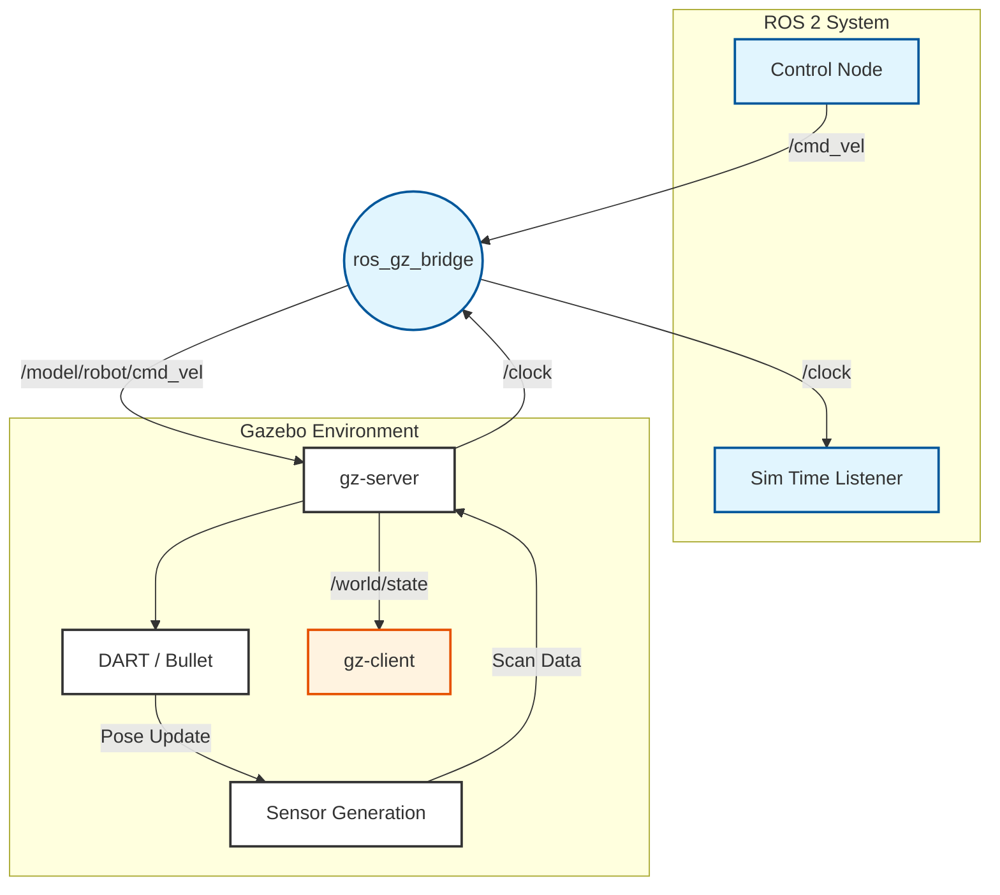

# Physics Simulation in Gazebo

:::info
**Topic Learning Objectives**
1.  **Explain** the core components of a physics engine (Integrator, Collision Detector, Solver).
2.  **Differentiate** between URDF and SDF file formats for robot description.
3.  **Configure** a simulation world with gravity, light, and terrain in Gazebo.
4.  **Implement** a simple physics plugin to apply forces to a rigid body.
:::

### Concept Overview

Gazebo is the de facto standard simulator for the ROS ecosystem. Unlike a game engine where visual fidelity is paramount, Gazebo prioritizes **physics fidelity** and **sensor accuracy**. It simulates the forces of nature—gravity, friction, inertia—allowing you to test if your robot will physically stand up, balance, or fall over.

In Physical AI, Gazebo is the "Gym." It is where the robot exercises its control policies against the laws of physics millions of times before entering the real world.

### System-Level Intuition

Imagine Gazebo as a **Virtual Laboratory**.

*   **The World (SDF)**: This is the lab room. It defines the environment—the floor, walls, lights, and global properties like gravity ($9.81 m/s^2$).
*   **The Robot (URDF/SDF)**: This is the experiment subject. It defines the robot's links (mass, inertia) and joints (motors, limits).
*   **The Plugins**: These are the lab instruments and invisible hands. They simulate sensors (LiDAR, Camera) and apply external forces (wind, push).

**Analogy**:
If ROS 2 is the **Nervous System** carrying signals, Gazebo is the **Physical World** that those signals interact with. The robot sends a "Move Arm" signal (ROS), and Gazebo calculates "Did the arm hit the table?" (Physics).

### Theory & Fundamentals

#### 1. The Physics Engine Loop
Gazebo relies on an external physics engine (default is DART in Gazebo Harmonic, ODE in Classic). The core loop involves solving the **Linear Complementarity Problem (LCP)** for contacts.

$$
M \dot{v} = f_{ext} + f_c
$$
$$
0 \le f_c \perp (J \dot{v} + \dot{J} v) \ge 0
$$

Where:
*   $M$: Mass Matrix
*   $v$: Velocity vector
*   $f_{ext}$: External forces (gravity, actuation)
*   $f_c$: Contact forces (unknowns to be solved)
*   $J$: Jacobian mapping constraints to workspace

#### 2. Inertial Properties
Accurate simulation requires precise inertial data. A link's resistance to rotational acceleration is defined by its Inertia Tensor $I$:
$$
I = \begin{bmatrix} I_{xx} & I_{xy} & I_{xz} \\ I_{yx} & I_{yy} & I_{yz} \\ I_{zx} & I_{zy} & I_{zz} \end{bmatrix}
$$
:::warning
**Garbage In, Garbage Out**: If your URDF has dummy inertia values (e.g., all 1.0), your simulation will be unstable and unrealistic. Always compute inertia based on CAD models.
:::

### Architecture & Components

Gazebo follows a Client-Server architecture:

1.  **gz-server (The Backend)**:
    *   Runs the physics loop.
    *   Generates sensor data.
    *   Headless execution (no GUI), perfect for cloud training.

2.  **gz-client (The Frontend)**:
    *   Visualizes the 3D world.
    *   Allows user interaction (spawning objects, pausing sim).
    *   Connects to server via **Gazebo Transport**.

3.  **The Bridge (ros_gz)**:
    *   Translates ROS 2 topics (`/cmd_vel`) to Gazebo topics (`/model/robot/cmd_vel`).
    *   Handles clock synchronization (`/clock`) to keep ROS time compatible with Sim time.

### Diagrams



### Algorithms & Models

#### Robot Description Formats

1.  **URDF (Unified Robot Description Format)**:
    *   **Pros**: Standard for ROS 2, simple XML structure.
    *   **Cons**: Cannot define simulation-specifics (friction, sensors, closed loops).
    *   **Use Case**: Defining the kinematic tree for the ROS Robot State Publisher.

2.  **SDF (Simulation Description Format)**:
    *   **Pros**: Native to Gazebo, supports everything (worlds, lights, plugins).
    *   **Cons**: More verbose than URDF.
    *   **Use Case**: Defining the simulation world and complex robot physics.

**Best Practice**: Write your robot in **URDF** for compatibility, and use the `<gazebo>` tag extension to inject SDF properties.

### Code Examples

#### 1. Defining a Physics-Ready Link (URDF)
Note the inclusion of `<inertial>` and `<collision>` blocks. Visual meshes are ignored by the physics engine.

```xml title="robot.urdf.xacro"
<link name="upper_arm">
  <!-- 1. Inertial: REQUIRED for physics -->
  <inertial>
    <mass value="1.5"/>
    <origin xyz="0 0 0.15"/>
    <inertia ixx="0.01" ixy="0" ixz="0" iyy="0.01" iyz="0" izz="0.005"/>
  </inertial>

  <!-- 2. Collision: The physical shape -->
  <collision>
    <geometry>
      <cylinder radius="0.05" length="0.3"/>
    </geometry>
    <surface>
      <friction>
        <ode>
          <mu>0.8</mu> <!-- Friction Coeff -->
        </ode>
      </friction>
    </surface>
  </collision>

  <!-- 3. Visual: What you see -->
  <visual>
    <geometry>
      <mesh filename="package://my_robot/meshes/upper_arm.dae"/>
    </geometry>
  </visual>
</link>
```

#### 2. Spawning in Gazebo (Launch File)
How to invoke the `ros_gz_sim` spawner node.

```python title="sim.launch.py"
from launch import LaunchDescription
from launch_ros.actions import Node

def generate_launch_description():
    return LaunchDescription([
        # 1. Start Gazebo Server
        Node(
            package='ros_gz_sim',
            executable='gz_sim_server',
            arguments=['-r', 'empty.sdf'], # -r starts sim immediately
        ),
        
        # 2. Spawn Entity
        Node(
            package='ros_gz_sim',
            executable='create',
            arguments=[
                '-topic', 'robot_description', # Read URDF from topic
                '-name', 'my_robot',
                '-z', '0.5' # Spawn 0.5m above ground
            ],
        )
    ])
```

### Practical Applications

*   **DARPA Robotics Challenge (DRC)**: The VRC (Virtual Robotics Challenge) used Gazebo to qualify teams before letting them touch real hardware.
*   **Agile Development**: CI/CD pipelines run Gazebo tests on every Pull Request to ensure new code doesn't cause the robot to crash.

### Common Pitfalls & Design Trade-offs

*   **Pitfall: The "Exploding Robot"**:
    *   *Cause*: Overlapping collision geometries at spawn or infinitely stiff PID gains.
    *   *Fix*: Check collision meshes, reduce P-gains, or use soft constraints.
*   **Trade-off: Mesh Complexity**:
    *   Using high-poly visual meshes for collisions kills performance.
    *   *Best Practice*: Use primitive shapes (box, cylinder, sphere) for collision, meshes only for visuals.

### Mini Project / Lab

**Task**: Create a "Bouncing Ball" World.

**Steps**:
1.  Create a file `bouncing_ball.sdf`.
2.  Add a standard `<world>` block with a `<sun>` and `<ground_plane>`.
3.  Add a `<model>` of a sphere.
4.  Set the sphere's restitution coefficient (bounciness) to 0.9.
5.  Launch Gazebo with this world.

**Expected Output**:
The ball should fall, hit the ground, and bounce nearly back to its original height, decaying slowly over time.

**Tools Required**:
*   Text Editor (VS Code)
*   `gz sim` command line tool

### Review & Checkpoints

*   **URDF vs SDF**: URDF for robot description (ROS standard), SDF for simulation environment (Gazebo native).
*   **Inertia Matters**: Physics engines require mass and inertia tensors to solve dynamics ($F=ma$).
*   **Bridge**: `ros_gz_bridge` connects the ROS 2 graph to the Gazebo simulation network.

### Further Reading

*   **Documentation**: [Gazebo Harmonic Docs](https://gazebosim.org/docs/harmonic/getstarted)
*   **Tutorial**: [Building a Robot in URDF](https://docs.ros.org/en/humble/Tutorials/Intermediate/URDF/Building-a-Visual-Robot-Model-with-URDF-from-Scratch.html)
*   **Open Source**: [ROS 2 Gazebo Packages](https://github.com/gazebosim/ros_gz)


