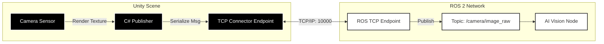

# High-Fidelity Rendering in Unity

:::info
**Topic Learning Objectives**
1.  **Contrast** the strengths of Gazebo (Physics) vs. Unity (Rendering).
2.  **Explain** the components of the High Definition Render Pipeline (HDRP).
3.  **Understand** the role of Domain Randomization in bridging the Sim-to-Real gap.
4.  **Set up** a basic Unity scene for generating synthetic training data.
:::

### Concept Overview

While Gazebo excels at physics, it often looks like a "cartoon" to a computer vision algorithm. Real-world cameras deal with lens flare, shadows, motion blur, and complex textures. **Unity** (and Unreal Engine) fills this gap by providing photorealistic rendering.

In Physical AI, Unity is the **Eye Doctor**. It trains the robot's vision system (Convolutional Neural Networks) to recognize objects in messy, imperfect lighting conditions before the robot ever opens its eyes in the real world.

### System-Level Intuition

Think of Unity as a **Hollywood Movie Set**.

*   **The Stage (Scene)**: Where all the action happens.
*   **The Actors (GameObjects)**: The robots, obstacles, and targets.
*   **The Camera (Main Camera)**: The robot's eye. What it sees is rendered to a Texture.
*   **The Special Effects (Post-Processing)**: Adding "film grain" or "color grading" to mimic the imperfections of real physical sensors.

**The Unity-ROS Connection**:
Instead of a direct cable, we often use a TCP/IP **Connector** (like the `Unity Robotics Hub`). Unity renders an image, compresses it, and sends it to a ROS topic (`/camera/image_raw`). ROS processes it and sends back a control command (`/cmd_vel`).

### Theory & Fundamentals

#### 1. The Rendering Pipeline
The goal is to convert a 3D description (vertices) into a 2D image (pixels).
*   **Rasterization**: The standard game technique. Fast, but struggles with accurate light reflections.
*   **Ray Tracing**: Simulates the path of individual light photons. Computationally expensive, but produces physically accurate reflections and shadows.

#### 2. Domain Randomization
A key challenge is the **Sim-to-Real Gap**. A model trained on perfect Unity grass might fail on real, muddy grass.
**Solution**: Randomize everything during training.
*   *Texture Randomization*: Change the floor from wood to tile to carpet.
*   *Lighting Randomization*: Change the sun's position and color.
*   *Physics Randomization*: Vary the friction and mass.

If the model learns to identify the target *despite* all this chaos, it becomes robust enough for the real world.

### Architecture & Components

1.  **GameObjects & Components**:
    *   Everything in Unity is a `GameObject`.
    *   Behavior is added via `Components` (e.g., `Rigidbody` for physics, `MeshRenderer` for looks, `MonoBehaviour` scripts for logic).

2.  **High Definition Render Pipeline (HDRP)**:
    *   Unity's engine for high-fidelity graphics.
    *   Uses **Physically Based Rendering (PBR)** materials (Albedo, Normal, Metallic, Smoothness) to mimic how real materials interact with light.

3.  **Unity Robotics Hub**:
    *   A set of tools to connect Unity and ROS 2.
    *   **URDF Importer**: Imports robot descriptions into Unity.
    *   **TCP Connector**: Serializes C# structs to ROS messages.

### Diagrams



### Algorithms & Models

#### 1. Synthetic Data Generation with Domain Randomization
The core idea is to vary parameters of the simulation environment randomly to generate diverse training data.

*   **Algorithm**:
    1.  **Initialize**: Load scene, robot, and objects.
    2.  **Randomize**: For each training step/episode:
        *   Change object positions, rotations, scales.
        *   Vary material properties (color, texture, reflectivity).
        *   Adjust lighting conditions (intensity, color, direction, number of lights).
        *   Modify camera intrinsics (focal length, distortion) and extrinsics (position, rotation).
        *   Add post-processing effects (noise, blur, vignette).
    3.  **Render**: Capture RGB, depth, and segmentation masks.
    4.  **Label**: Automatically generate ground truth labels (bounding boxes, object IDs) from the simulation state.
    5.  **Output**: Save rendered images and labels.

#### 2. Inverse Graphics (Future Work)
The dream is to go from real-world data to a perfect simulation.
*   **Goal**: Estimate scene parameters (lighting, object pose, materials) from real images to create a more accurate digital twin.

### Code Examples

#### 1. C# Script for Randomizing Object Position
Attach this script to a GameObject in Unity to randomize its position within a specified range.

```csharp title="RandomizePosition.cs"
using UnityEngine;

public class RandomizePosition : MonoBehaviour
{
    public Vector3 minPosition = new Vector3(-1f, 0f, -1f);
    public Vector3 maxPosition = new Vector3(1f, 0f, 1f);

    void Start()
    {
        Randomize();
    }

    public void Randomize()
    {
        float x = Random.Range(minPosition.x, maxPosition.x);
        float y = Random.Range(minPosition.y, maxPosition.y);
        float z = Random.Range(minPosition.z, maxPosition.z);
        transform.position = new Vector3(x, y, z);
    }
}
```

#### 2. C# Script for Capturing Camera Image to ROS Topic (Conceptual)
This is a high-level conceptual example using the Unity Robotics Hub API.

```csharp title="RosCameraPublisher.cs"
using UnityEngine;
using Unity.Robotics.ROSTCPConnector;
using RosMessageTypes.Sensor; // Example ROS Image message type

public class RosCameraPublisher : MonoBehaviour
{
    public Camera targetCamera;
    public string rosTopic = "/camera/image_raw";
    public int publishRateHz = 30;

    private ROSConnection ros;
    private float timeElapsed;

    void Start()
    {
        ros = ROSConnection.Get;
        ros.RegisterPublisher<ImageMsg>(rosTopic);
    }

    void Update()
    {
        timeElapsed += Time.deltaTime;
        if (timeElapsed > 1f / publishRateHz)
        {
            PublishCameraImage();
            timeElapsed = 0;
        }
    }

    void PublishCameraImage()
    {
        if (targetCamera == null) return;

        // Create a render texture and render the camera's view
        RenderTexture rt = new RenderTexture(targetCamera.pixelWidth, targetCamera.pixelHeight, 24);
        targetCamera.targetTexture = rt;
        Texture2D image = new Texture2D(targetCamera.pixelWidth, targetCamera.pixelHeight, TextureFormat.RGB24, false);
        targetCamera.Render();
        RenderTexture.active = rt;
        image.ReadPixels(new Rect(0, 0, targetCamera.pixelWidth, targetCamera.pixelHeight), 0, 0);
        image.Apply();
        targetCamera.targetTexture = null;
        RenderTexture.active = null;
        Destroy(rt);

        byte[] imageData = image.EncodeToJPG(); // Or EncodeToPNG

        // Create and populate ROS Image message
        ImageMsg imageMsg = new ImageMsg
        {
            header = new Std.HeaderMsg { stamp = new RosMessageTypes.BuiltinInterfaces.TimeMsg { sec = (int)Time.time, nanosec = (uint)((Time.time % 1) * 1e9) }, frame_id = targetCamera.name },
            height = (uint)image.height,
            width = (uint)image.width,
            encoding = "jpeg", // Or "rgb8" for PNG
            is_bigendian = 0,
            step = (uint)image.width * 3, // For RGB24, 3 bytes per pixel
            data = imageData
        };

        ros.Publish(rosTopic, imageMsg);
        Destroy(image);
    }
}
```

### Practical Applications

*   **Autonomous Driving**: Training perception models (object detection, semantic segmentation) on millions of synthetic driving scenarios before real-world testing.
*   **Robotics Pick-and-Place**: Generating diverse datasets of objects in various poses and lighting conditions for robotic manipulation.
*   **XR (eXtended Reality)**: Creating realistic virtual environments for human-robot interaction studies or robot teleoperation.

### Common Pitfalls & Design Trade-offs

*   **Pitfall: Poor Asset Quality**: Low-resolution textures or poorly modeled meshes will look bad and might not fool the vision model.
    *   *Fix*: Invest in high-quality assets or use procedural generation.
*   **Trade-off: Rendering Speed vs. Fidelity**: Ray tracing is beautiful but slow. Rasterization is fast but less accurate.
    *   *Best Practice*: Use ray tracing for ground truth generation (offline), and rasterization for real-time simulation (if fidelity is acceptable).

### Mini Project / Lab

**Task**: Generate a Synthetic Dataset of a Cube.

**Steps**:
1.  **Set up Unity**: Create a new 3D project, install `HDRP` and `Unity Robotics Hub`.
2.  **Create Scene**: Add a `Plane` (ground), a `Cube`, and a `Directional Light`.
3.  **Randomize**: Attach `RandomizePosition.cs` to the cube.
4.  **Capture**: Use the conceptual `RosCameraPublisher.cs` (or a similar asset from Unity Robotics Hub) to capture RGB images.
5.  **Output**: Stream images to a ROS 2 topic or save them to disk.

**Expected Output**:
A dataset of images where a cube appears in various positions within the camera's view.

**Tools Required**:
*   Unity Editor (2022.3 LTS recommended)
*   ROS 2 Foxy/Humble/Iron
*   `Unity Robotics Hub` package

### Review & Checkpoints

*   **Gazebo vs. Unity**: Physics simulation vs. high-fidelity rendering.
*   **Domain Randomization**: Crucial for bridging the Sim-to-Real gap in vision.
*   **Unity Robotics Hub**: The bridge for ROS 2 integration.

### Further Reading

*   **Documentation**: [Unity Manual](https://docs.unity3d.com/Manual/index.html), [Unity HDRP](https://docs.unity3d.com/Packages/com.unity.render-pipelines.high-definition@latest/index.html)
*   **Unity Robotics**: [Unity Robotics Hub](https://github.com/Unity-Technologies/Unity-Robotics-Hub)
*   **Paper**: [Domain Randomization for Transferring Deep Neural Networks from Simulation to the Real World](https://arxiv.org/abs/1703.06907)


