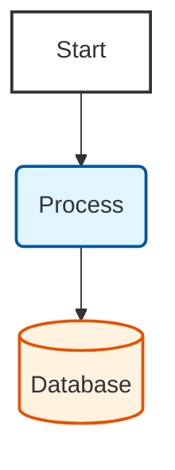

# Mermaid Diagram Styles

:::note
Use the following class definitions in all Mermaid diagrams to maintain visual consistency across the module.
:::

```mermaid
classDef box fill:#fff,stroke:#333,stroke-width:2px;
classDef proc fill:#e1f5fe,stroke:#01579b,stroke-width:2px;
classDef db fill:#fff3e0,stroke:#e65100,stroke-width:2px;
```

**Usage Example:**


