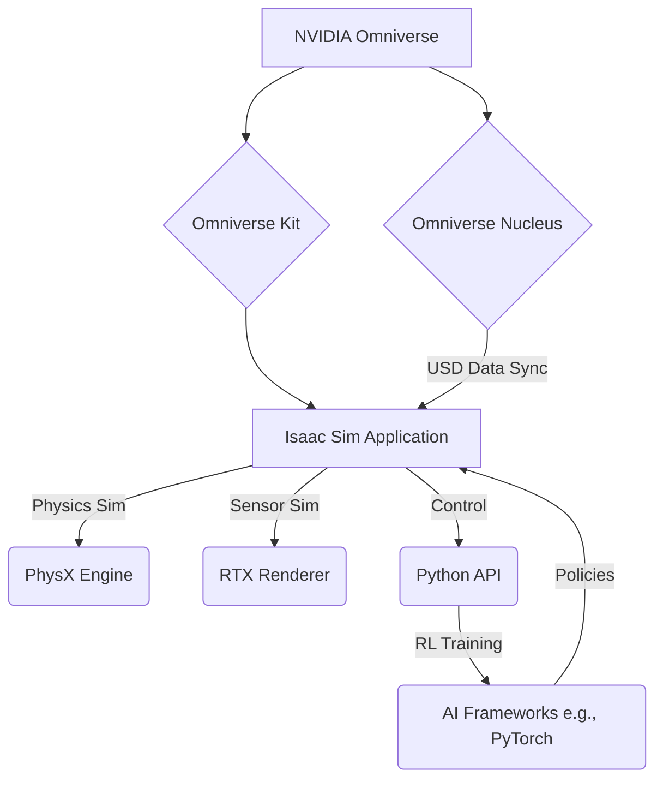

## Concept Overview
NVIDIA Isaac Sim is a scalable robotics simulation application and synthetic data generation tool built on NVIDIA Omniverse™. It provides a high-fidelity virtual environment where developers can create, test, and manage AI-powered robots. Its primary purpose is to bridge the 'reality gap' by offering photorealistic rendering, accurate physics simulation, and access to an extensive library of 3D assets. For Physical AI, Isaac Sim is crucial as it enables the training of complex deep learning models in a safe, controlled, and cost-effective virtual space, generating vast amounts of diverse synthetic data that would be impractical to collect in the real world. This capability is particularly vital for humanoid robotics, allowing for the rapid iteration of perception, navigation, and manipulation algorithms without risking physical hardware or human safety.

## System-Level Intuition
Think of Isaac Sim as a highly sophisticated, customizable 'training ground' for robots, much like a flight simulator for pilots or a virtual reality lab for scientists. For a humanoid robot system, Isaac Sim fits in as:
*   **Virtual World Builder**: It allows engineers to design complex 3D environments, complete with realistic physics (gravity, friction, collisions) and diverse objects, mimicking real-world scenarios. This is invaluable for testing navigation or manipulation tasks.
*   **Data Factory**: Instead of costly and time-consuming real-world data collection, Isaac Sim can automatically generate vast quantities of labeled sensor data (e.g., RGB images, depth maps, lidar scans, bounding boxes for objects). This synthetic data is crucial for training deep learning perception models without human annotation effort.
*   **Safe Experimentation Lab**: Before deploying algorithms on expensive and potentially fragile physical humanoid robots, Isaac Sim provides a risk-free space for rapid iteration, debugging, and testing of new control policies or AI behaviors. A robot falling in simulation is easily reset, unlike in reality.
*   **Scalable Training Platform**: Its integration with NVIDIA's computing ecosystem allows for large-scale, parallel training of reinforcement learning agents, drastically accelerating the learning process for complex humanoid behaviors.

## Theory & Fundamentals
Isaac Sim leverages fundamental principles of computer graphics, physics simulation, and machine learning:
*   **Physics Engines**: At its core, Isaac Sim employs an NVIDIA PhysX-based engine to simulate rigid body dynamics, joint constraints, collisions, and realistic material interactions. This relies on numerical integration methods to solve differential equations governing motion ($$\mathbf{F} = m\mathbf{a}$$).
*   **Ray Tracing/Path Tracing**: For photorealistic rendering and accurate sensor simulation, Isaac Sim utilizes NVIDIA's Omniverse RTX Renderer. This involves tracing the path of light rays to model reflections, refractions, and global illumination, providing highly realistic visual data for training perception models.
*   **Synthetic Data Generation (SDG)**: This involves procedurally generating diverse 3D environments, varying object textures, lighting conditions, and camera parameters. The theoretical underpinning often involves concepts from domain randomization, where diverse simulated data helps improve the generalization of AI models to the real world. Mathematically, this can be seen as sampling from a high-dimensional distribution of possible real-world scenarios.
*   **Reinforcement Learning (RL)**: Isaac Sim is tightly integrated with popular RL frameworks (e.g., Isaac Gym for GPU-accelerated RL) where agents learn optimal policies through trial and error within the simulated environment. The mathematical foundations include Markov Decision Processes (MDPs), value functions ($$V(s)$$), and policy functions ($$\pi(s)$$).

## Architecture & Components
Isaac Sim is built on NVIDIA Omniverse, a platform for connecting and building 3D applications. Its architecture involves several key components:
*   **Omniverse Nucleus**: A database and collaboration engine that enables real-time exchange of USD (Universal Scene Description) data between various Omniverse applications, including Isaac Sim.
*   **USD (Universal Scene Description)**: Pixar's open-source 3D scene description format, which serves as the foundation for defining assets, environments, and robots within Isaac Sim.
*   **Omniverse Kit**: A collection of microservices and an extensible framework for building Omniverse applications. Isaac Sim itself is an Omniverse Kit application.
*   **PhysX**: NVIDIA's scalable multi-physics engine responsible for accurate rigid body dynamics, fluid simulations, and collision detection within the simulated environments.
*   **RTX Renderer**: Provides photorealistic rendering capabilities, enabling the generation of high-fidelity visual data and sensor simulations.
*   **Python API**: A comprehensive set of Python bindings allows for programmatic control of all aspects of the simulation, from environment setup and robot articulation to sensor configuration and data logging. This Python API facilitates the creation of complex simulation workflows and integration with external AI frameworks.

The typical pipeline within Isaac Sim involves:
1.  **Scene Creation**: Defining the 3D environment, assets, and robot models using USD.
2.  **Robot Control**: Programmatically controlling robot joints and effectors via the Python API or integrated ROS/ROS 2 bridges.
3.  **Sensor Simulation**: Emulating various sensors (cameras, LiDAR, IMU) to generate synthetic data.
4.  **Data Collection**: Logging simulated sensor data and ground truth information (e.g., object poses, semantic segmentation masks).
5.  **AI Integration**: Connecting with external AI frameworks (e.g., PyTorch, TensorFlow) for model training (e.g., reinforcement learning agents or perception networks) using the collected synthetic data.
6.  **Deployment**: Testing trained policies or models directly within the high-fidelity simulation environment.

## Diagrams (MANDATORY)
This diagram illustrates the high-level architecture and data flow within NVIDIA Isaac Sim, built on the Omniverse platform.


## Algorithms & Models
Isaac Sim provides a powerful environment for implementing and testing various robotics algorithms and models, especially those related to simulation and reinforcement learning:
*   **Synthetic Data Generation (SDG) Pipelines**: Isaac Sim allows users to define pipelines for generating synthetic datasets with automatic labeling. This involves randomizing environmental factors (lighting, textures, object positions) and extracting ground truth data like bounding boxes, segmentation masks, and depth maps. The core algorithm here is often a randomized sampling strategy to maximize data diversity.
    *   **Pseudocode for SDG**:
        ```
        function generate_synthetic_data(num_samples, environment_params):
            dataset = []
            for i from 1 to num_samples:
                scene = create_randomized_scene(environment_params)
                robot = spawn_robot_in_scene(scene)
                set_random_robot_pose(robot)
                render_output = render_scene(scene, robot)
                ground_truth = extract_ground_truth(scene, robot)
                dataset.append((render_output, ground_truth))
            return dataset
        ```
*   **Reinforcement Learning (RL) Frameworks**: Isaac Sim integrates deeply with NVIDIA's Isaac Gym and other RL libraries (e.g., Rl-games, Stable-Baselines3). Algorithms like Proximal Policy Optimization (PPO), Soft Actor-Critic (SAC), or Domain Randomization are commonly used for training robotic policies. Isaac Gym is specifically optimized for GPU-accelerated parallel RL, allowing thousands of environments to run concurrently.
    *   **Pseudocode for RL Training Loop (High-Level)**:
        ```
        initialize_policy(agent)
        for episode from 1 to max_episodes:
            reset_environment(isaac_sim_env) # Reset all parallel environments
            while not episode_done:
                action = agent.select_action(state)
                next_state, reward, done = isaac_sim_env.step(action)
                agent.store_transition(state, action, reward, next_state, done)
                state = next_state
                if agent.ready_to_update():
                    agent.update_policy() # e.g., PPO update
        ```
*   **Physics-Based Control**: While full control algorithms are often external, Isaac Sim's accurate physics engine allows for testing various control strategies (e.g., inverse kinematics solvers, PID controllers) for robot manipulators and locomotors within the simulation before deployment on hardware.

## Code Examples (MANDATORY)
This Python script demonstrates a minimal example of creating a new stage in Isaac Sim and adding a simple USD prim (a cube). This is a foundational step for building any simulation environment.

```python
import omni.usd
from pxr import UsdGeom, Gf

def create_cube_in_isaac_sim():
    """
    Creates a new stage and adds a cube prim to it.
    This script is intended to be run within the Isaac Sim environment's script editor,
    or loaded as an extension.
    """
    # Get the current USD context and create a new stage
    context = omni.usd.get_context()
    context.new_stage()
    stage = context.get_stage()

    print("New empty stage created.")

    # Define the path for the new cube prim
    cube_path = "/World/Looks/Cube"

    # Create a UsdGeom.Cube prim
    cube_prim = UsdGeom.Cube.Define(stage, cube_path)

    # Set properties for the cube
    cube_prim.GetSizeAttr().Set(200.0) # Size in USD units (cm by default)
    cube_prim.GetExtentAttr().Set([
        Gf.Vec3f(-100.0, -100.0, -100.0),
        Gf.Vec3f(100.0, 100.0, 100.0)
    ])

    # Get the prim's transform and set its position
    xform = UsdGeom.Xformable(cube_prim.GetPrim())
    translate_op = xform.AddTranslateOp()
    translate_op.Set(Gf.Vec3f(0.0, 0.0, 100.0)) # Position in the world (z-up)

    print(f"Cube prim created at path: {cube_path}")

    # For visualization within Isaac Sim, saving the stage or refreshing the view might be needed.
    # In a live Isaac Sim session, the cube should appear immediately.

if __name__ == "__main__":
    create_cube_in_isaac_sim()
```
**Note**: This script is designed to be executed within the Isaac Sim environment (e.g., in its built-in script editor or as part of an extension). Running it directly as a standalone Python script requires a specific Omniverse Kit setup. The core logic demonstrates using the `omni.usd` API to manipulate the scene.

## Practical Applications
NVIDIA Isaac Sim is indispensable across various practical applications in robotics:
*   **Humanoid Robot Design and Testing**: Accelerating the development cycle of humanoid robots by providing a platform for testing mechanical designs, control algorithms, and AI behaviors before hardware fabrication. This includes simulating complex gaits, balance control, and dexterous manipulation tasks.
*   **Synthetic Data Generation for AI Training**: Generating massive, diverse datasets for training perception models (e.g., object detection, pose estimation, semantic segmentation) for real-world robots. This is particularly valuable for rare events or scenarios difficult to capture with real sensors.
*   **Reinforcement Learning for Robot Control**: Training robust and adaptable control policies for robots in complex, unstructured environments. Isaac Sim's GPU-accelerated simulation capabilities enable rapid iteration and exploration of large policy spaces.
*   **Robotics Fleet Management and Digital Twins**: Creating digital twins of physical robot fleets and their environments to monitor performance, predict maintenance needs, and test software updates offline before deploying them to live robots.
*   **Virtual Prototyping and Factory Simulation**: Designing and optimizing factory layouts, robotic work cells, and automation processes in a virtual environment, reducing physical prototyping costs and time.
*   **Human-Robot Interaction Studies**: Simulating human-robot interaction scenarios to develop safer and more intuitive collaborative robotics applications.

## Common Pitfalls & Design Trade-offs
While highly powerful, using Isaac Sim effectively involves navigating several common pitfalls and design trade-offs:
*   **Reality Gap (Persistent Challenge)**: Despite high fidelity, perfect simulation-to-reality transfer (sim2real) remains an active research area. Differences in sensor noise models, unmodeled physics, and material properties can lead to policies trained in simulation failing in the real world. Trade-off: increased simulation fidelity (higher computational cost) vs. domain randomization (more generalizable policies, but potentially less performant).
*   **Computational Overhead**: High-fidelity physics and photorealistic rendering are computationally intensive. Running complex simulations or many parallel environments for RL requires significant GPU resources, which can be a bottleneck. Trade-off: realism vs. speed/scalability.
*   **Asset Creation and Management**: Building realistic 3D assets and environments can be time-consuming and require specialized skills. The quality and variety of assets directly impact the effectiveness of synthetic data generation. Trade-off: detailed, custom assets vs. generic, reusable assets.
*   **Learning Curve**: Isaac Sim, being a comprehensive platform, has a steep learning curve, especially for users unfamiliar with USD, Omniverse Kit, or Python scripting for simulation control.
*   **Debugging Complex Behaviors**: Debugging reinforcement learning agents or complex control systems within a high-dimensional simulation can be challenging. Visualizing internal states or policy decisions often requires custom tooling.

## Mini Project / Lab
**Task Description**: Create a simple Isaac Sim environment with a robot (e.g., a UR5 from the built-in assets) and programmatically control its end-effector to reach a target pose. Additionally, set up a basic camera sensor and demonstrate how to capture an RGB image from the simulated environment.
**Expected Output**: The robot in Isaac Sim should move its end-effector to the specified target. An RGB image of the scene should be saved to a designated folder.
**Tools Required**: NVIDIA Isaac Sim installed, Python 3.10+, Omniverse Kit SDK for Python scripting, basic understanding of robot kinematics.

## Review & Checkpoints
*   **Isaac Sim Overview**: NVIDIA Isaac Sim is a powerful simulation platform built on Omniverse for robotics development, training, and synthetic data generation.
*   **Key Capabilities**: Photorealistic rendering, accurate physics simulation, and extensive Python API for programmatic control.
*   **Role in AI**: Crucial for bridging the reality gap, generating synthetic data, and scaling reinforcement learning for robots, especially humanoids.
*   **Core Components**: Omniverse Nucleus, USD, Omniverse Kit, PhysX, RTX Renderer.

**Conceptual Checkpoints**:
1.  Explain how Isaac Sim helps to address the "reality gap" in robotics development.
2.  Describe the primary benefit of synthetic data generation in Isaac Sim for AI training.
3.  Identify at least three core components of Isaac Sim's architecture and their roles.

## Further Reading
**Papers**:
*   [NVIDIA Isaac Sim Documentation](https://docs.omniverse.nvidia.com/isaacsim/latest/index.html)
*   [Domain Randomization for Transferring Deep Neural Networks from Simulation to the Real World](https://arxiv.org/abs/1703.06907) by Tobin et al. (2017).

**Books**:
*   *Probabilistic Robotics* by Sebastian Thrun, Wolfram Burgard, and Dieter Fox. (Covers fundamental robotics concepts relevant to simulation.)

**Open-source projects**:
*   **Isaac Gym**: NVIDIA's platform for GPU-accelerated reinforcement learning in simulation.
*   **ROS (Robot Operating System)**: Integration with Isaac Sim is common for robotics workflows.
*   **OmniGraph**: A node-based visual programming interface within Omniverse for creating complex behaviors and logic.
